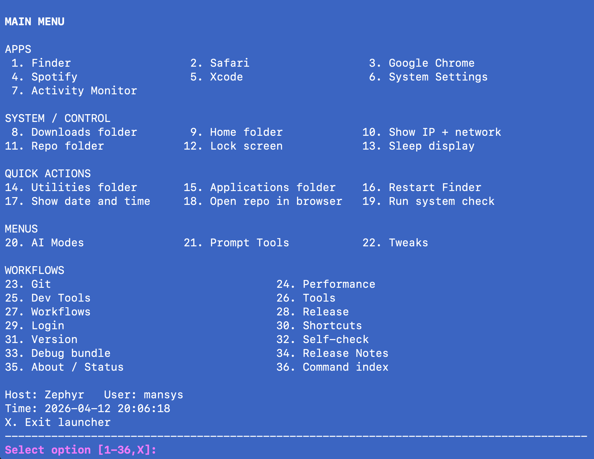
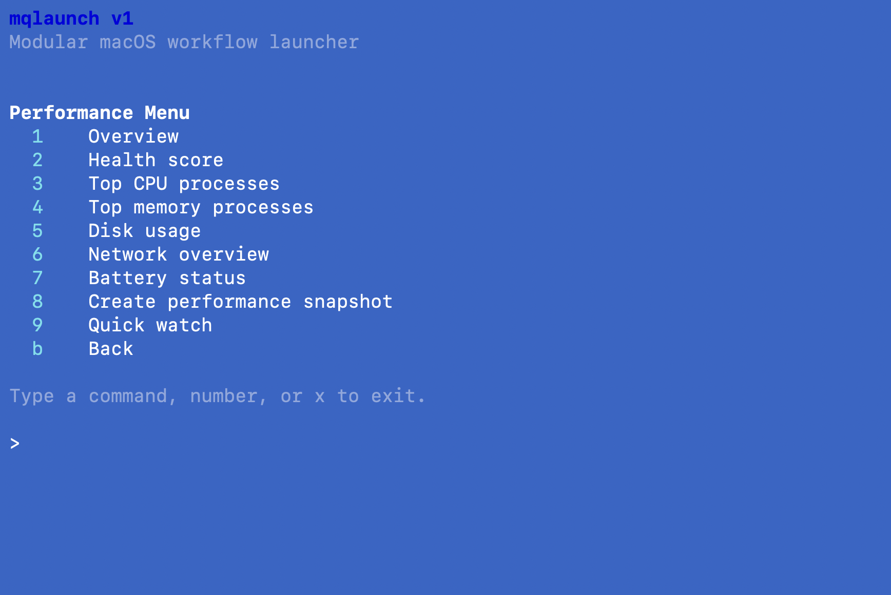
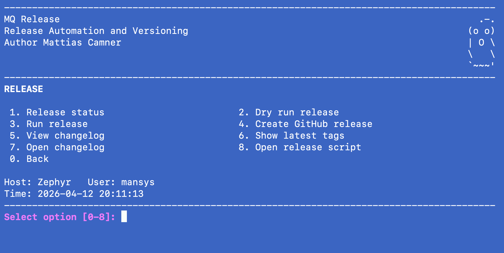

# macos-scripts


⚡ Turn scattered shell commands into structured workflows.

**Stop memorizing commands. Start running workflows.**

Turn scattered shell commands into a clean, repeatable workflow system.

---

## 🚀 Quick start

```bash
curl -fsSL https://raw.githubusercontent.com/MCamner/macos-scripts/main/install.sh | bash

mqlaunch doctor
mqlaunch

### Option 2 — Clone

```bash
git clone https://github.com/MCamner/macos-scripts.git
cd macos-scripts
./install.sh
```

---

## 🚀 First run

After installing, start here:

mqlaunch doctor

This will:

- verify your environment
- check required dependencies
- validate your setup
- highlight issues with clear fixes

Then explore:

mqlaunch

→ browse workflows via the interactive menu  
→ or run commands directly (perf, system, dev, tools)

💡 Recommended flow

1. mqlaunch doctor   → validate setup  
2. mqlaunch          → explore workflows  
3. mqlaunch perf     → try a real workflow  

→ from zero to productive in under a minute

---

## ⚡ One command instead of many

Instead of:

```bash
top
df -h
ps aux | sort -nrk 3 | head
./tools/scripts/system-check.sh
```

Run:

```bash
mqlaunch perf
```

---

## 🎯 What this solves

Most environments don’t lack tools — they lack structure.

Typical problems:

- scattered scripts across folders  
- commands hard to discover  
- inconsistent execution  
- reliance on memory / tribal knowledge  

**macos-scripts fixes this by turning:**

> useful chaos → usable system

---

## 🧠 Core idea

> One command → structured workflows → repeatable execution

- single entrypoint: `mqlaunch`
- organized workflows (Dev, System, Performance, Tools)
- works as menu **and** direct CLI
- built for real-world terminal usage

---

## 🧩 How it works

```text
User → mqlaunch → Workflows → Scripts → System
```

- CLI = control layer  
- workflows = structure  
- scripts = execution  
- system = environment  

---

## 🧰 Common commands

```bash
mqlaunch              # open menu
mqlaunch perf         # performance tools
mqlaunch system check # system health
mqlaunch dev          # dev workflows
mqlaunch tools        # utilities
mqlaunch demo         # demo mode
```

---
## 🩺 Health check

Before diving into workflows, verify your environment.

Run:

mqlaunch doctor

What it does:

- checks required tools (git, brew, node, python, jq)
- validates repo state (branch, dirty tree, required files)
- evaluates workflow readiness (Git, Release, Dev, System)
- highlights issues and gives actionable recommendations

Example use:

mqlaunch doctor

→ quickly understand if your environment is ready  
→ fix issues before running workflows  
→ reduce debugging time and surprises

💡 Tip  
Run this after install or when something feels off.

---

## 🎬 Demo

```bash
mqlaunch demo
```

---

## 🖼️ Screenshots

### Main Menu
<p align="center">
  
</p>

### Performance Menu
<p align="center">
  
</p>

### Release Flow
<p align="center">
  
</p>

---

## 🧱 Project structure

```text
macos-scripts/
├── bin/               # CLI entrypoints
├── terminal/          # menus, launchers, themes
├── tools/             # scripts and utilities
├── system/            # macOS helpers
├── automation/        # workflows
└── ui/                # terminal UI
```

---

## ⚖️ Design principles

- keep it simple  
- structure > more tools  
- optimize for real usage  
- make workflows repeatable  
- reduce cognitive load  

---

## 📈 Real use case

Example:

Instead of remembering 5–10 system commands during troubleshooting:

- open CLI  
- search commands  
- run manually  

You run:

```bash
mqlaunch system check
```

→ full system overview in one step

---

## 🔭 Roadmap

- workflow validation / health checks  
- plugin-style extensions  
- remote execution support  
- improved onboarding  

---

## 🤝 Contributing

PRs welcome.  
If you have ideas for workflows or improvements — open an issue.

---

## 📄 License

MIT
