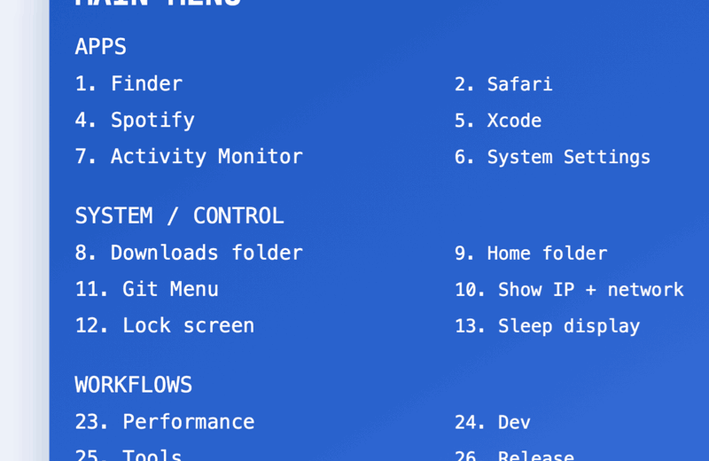

# macos-scripts

<p align="center">
  <b>⚡ Turn your macOS terminal into a fast, modular command center</b><br>
  Run workflows, monitor your system, and manage your projects — all from one place.
</p>

<p align="center">
  
  
  
  
  
</p>

---

## 🎬 Demo

<p align="center">
  
</p>

> 👉 Shows the `mqlaunch` command surface and main workflow menu

---

## ⚡ What it feels like

```bash
mqlaunch
```

* Instant access to tools
* Real-time system insight
* Structured workflows instead of scattered scripts

👉 Think **Raycast for your terminal**

---

## 🧩 What you get

⚡ mqlaunch — central command launcher  
📊 Performance — system health & monitoring  
🛠 Dev — git + repo workflows  
📦 Tools — scripts, CLI utilities, guides  
🚀 Release — safe versioning with automation (dry-run + rollback)  
🔌 Modular architecture — evolve without breaking

---

## 🚀 Quick Start

```bash
git clone https://github.com/MCamner/macos-scripts.git
cd macos-scripts
chmod +x install.sh
./install.sh
```

Then:

```bash
mqlaunch
```

---

## 🚀 Try this first

```bash
mqlaunch perf
```

Press:

* `1` → Overview
* `2` → Health score
* `8` → Snapshot
* `9` → Live monitoring

Then:

```bash
mqlaunch dev
mqlaunch tools
```

---

## 🧠 Core Commands

```bash
mqlaunch        # Open launcher
mqlaunch perf   # System performance
mqlaunch dev    # Dev workflows
mqlaunch tools  # Tools & scripts
```

---

🚀 Release workflow

Safe and repeatable release process using:

tools/release.sh

Preview release without changes:

./tools/release.sh --dry-run 0.1.3

Run full release:

./tools/release.sh 0.1.3

Includes:

- version sync (VERSION + README)
- changelog validation
- git commit + tag
- safe rollback on failure

---

## 🖥️ Preview

```
mqlaunch perf

Performance Menu
1  Overview
2  Health score
3  Top CPU processes
4  Top memory processes
5  Disk usage
6  Network overview
7  Battery status
8  Create snapshot
9  Quick watch
b  Back
```

---

## 🏗️ Project Structure

```
macos-scripts/
├── terminal/
│   ├── bridges/       # legacy → v1 routing
│   ├── launchers/     # production launcher
│   └── mqlaunch-v1/   # modular system
├── tools/             # scripts & guides
├── system/            # macOS tweaks
├── automation/        # workflows
├── ui/                # terminal UI
├── docs/              # demo + pages
└── install.sh
```

---

## 🧠 Architecture

This project uses a **safe migration model**:

* legacy launcher stays stable
* new modules built in **v1 architecture**
* bridges connect old → new
* no risky rewrites

👉 evolve fast without breaking workflows

---

## 🔧 Modules

### ⚡ Performance

* system overview
* health score
* CPU / memory
* disk usage
* network info
* battery status
* snapshots
* live monitoring

### 🛠 Dev

* repo health
* git status / pull / push
* commit history
* branch overview
* repo navigation

### 📦 Tools

* scripts & CLI tools
* terminal guide
* repo structure view
* README discovery

---

## 🎯 Use Cases

* bootstrap a new Mac
* speed up terminal workflows
* build a personal CLI workspace
* organize scripts into a real system

---

## 🧠 Philosophy

* simple > complex
* practical > theoretical
* fast > perfect
* modular evolution > rewrites

---

## 🗺️ Roadmap

🗺️ Roadmap

* GitHub release integration (gh CLI)  
* release validation tooling  
* mqlaunch release workflow integration  
* plugin-style modules  
* remove legacy layer

---

## 👤 Author

**Mattias Camner**
🌐 https://mcamner.github.io/macos-scripts/

---

## ⭐️ If you like it

Star ⭐
Fork 🍴
Build your own terminal system ⚡


