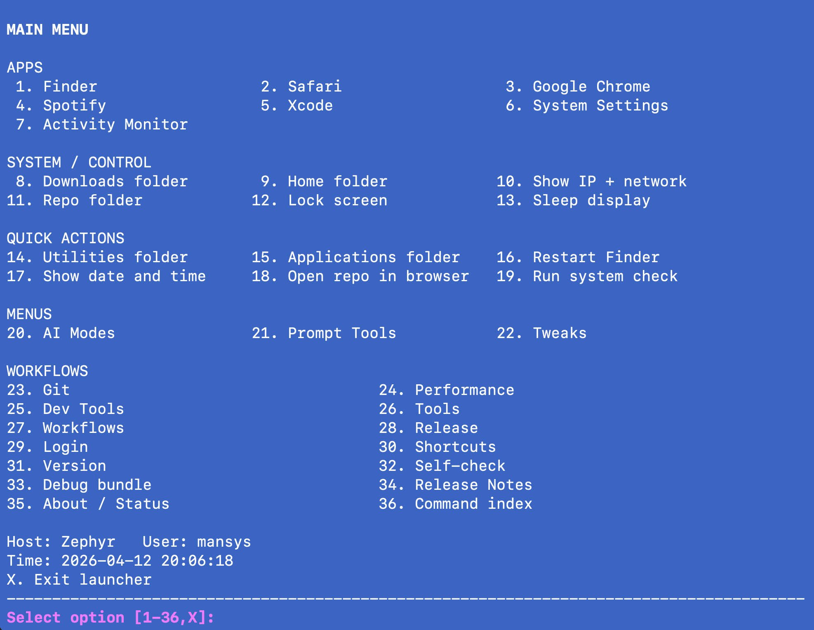
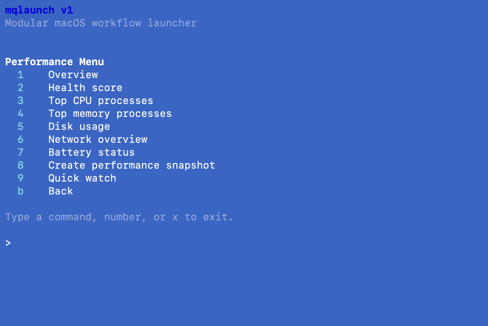
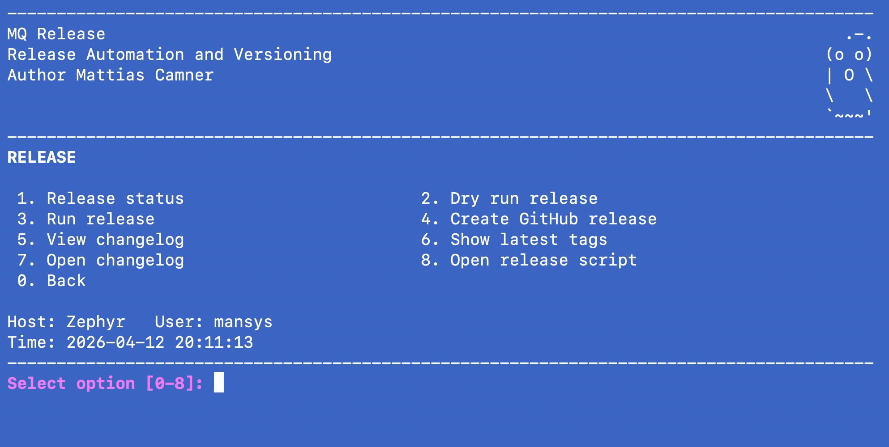

# macos-scripts ⚡


Turn scattered shell commands into structured workflows.

👉 **View case study:**
[mcamner.github.io/macos-scripts/case.html](https://mcamner.github.io/macos-scripts/case.html)

Stop memorizing commands. Start running workflows.

---

## 🚀 Quick start

### Option 1 — Install (recommended)

```bash
curl -fsSL https://raw.githubusercontent.com/MCamner/macos-scripts/main/install.sh | bash
```

### Option 2 — Clone

```bash
git clone https://github.com/MCamner/macos-scripts.git
cd macos-scripts
./install.sh
```

---

## ⚡ First run

```bash
mqlaunch doctor
```

This will:

* verify your environment
* check required dependencies
* validate your setup
* highlight issues with clear fixes

---

## 🚦 Then explore

```bash
mqlaunch
```

* browse workflows via the interactive menu
* or run commands directly (`perf`, `system`, `dev`, `tools`)

---

## ⚡ One command instead of many

Instead of:

```bash
top
df -h
ps aux | sort -nrk 3 | head
./tools/scripts/system-check.sh
```

Run:

```bash
mqlaunch perf
```

---

## 🎯 What this solves

Most environments don't lack tools — they lack structure.

This project turns:

> useful chaos → usable system

---

## 🧠 Core idea

One command → structured workflows → repeatable execution

* single entrypoint: `mqlaunch`
* organized workflows (Dev, System, Performance, Git, Release, Tools)
* works as interactive menu and direct CLI
* built-in AI for questions, code generation, and error fixes

---

## 🧰 Common commands

```bash
mqlaunch                         # interactive menu
mqlaunch perf                    # performance overview
mqlaunch system check            # system health
mqlaunch dev                     # dev workflows
mqlaunch git                     # git menu
mqlaunch release                 # release menu
mqlaunch ask "your question"     # AI repo assistant
mqlaunch srm ask "your question" # Semantic Repository Memory assistant
mqlaunch fix "error or task"     # AI generates copy-paste shell commands
mqlaunch atlas                   # AI REPL session
mqlaunch hal "your request"      # local Ollama-powered safe command router
mqlaunch hal repos               # list HAL-known repos
mqlaunch hal raw "your request"  # show parsed JSON intent
mqlaunch hal doctor              # summarize mqlaunch doctor --json with local HAL
mqlaunch hal fix-doctor          # create safe fix plan from HAL Doctor Summary
mqlaunch hal session             # show local HAL session memory
mqlaunch hal last                # show latest HAL memory item
mqlaunch hal remember "note"     # save a local HAL note
mqlaunch hal timeline            # show HAL session memory as compact timeline
mqlaunch doctor                  # environment check
mqlaunch doctor --json           # machine-readable JSON health report
mqlaunch selftest                # smoke tests + shell lint
mqlaunch release-check           # release readiness check
mqlaunch demo                    # guided demo
```

👉 **Full command reference:** [docs/COMMANDS.md](docs/COMMANDS.md)

---

## 🤖 AI assistant

Ask questions about the repo directly in the terminal:

```bash
mqlaunch ask "how does command routing work?"
mqlaunch ask "what does doctor.sh check?"
```

The repo assistant uses Semantic Repository Memory by default:

```bash
MQ_REPO_VECTOR_STORE_ID=vs_your_repo_store_id
```

Query a specific Semantic Repository Memory store with the Responses API:

```bash
mqlaunch srm inspect
mqlaunch srm ask "what repo is indexed here?"
SRM_VECTOR_STORE_ID=vs_your_semantic_memory_store_id mqlaunch srm search "vector store upload flow"
```

Start an interactive session with Atlas — a senior systems engineer
embedded in mqlaunch:

```bash
mqlaunch atlas
```

```text
atlas> why is my push being blocked?
atlas> explain the release flow
atlas> exit
```

Atlas answers inline without opening a browser.

---

## 🔧 Fix and generate code

Get copy-paste ready shell commands for errors and tasks:

```bash
mqlaunch fix "ERROR: CHANGELOG does not contain version 0.1.9"
mqlaunch fix "write a function that checks if a port is in use"
mqlaunch fix "add option 13 'View stash' to the git menu"
```

Output is always runnable — `cat` heredocs, `sed`, `mkdir` — no theory:

```bash
# Add changelog section for 0.1.9
cat >> CHANGELOG.md << 'EOF'
## [0.1.9] - 2026-05-07
### Changed
* ...
EOF
```

Copy, paste, run. Uses repo context from the vector store.

---

## 🚢 Release workflow

Auto Release handles the full release cycle in one flow:

```bash
mqlaunch release
# → select option 11: Auto Release
```

Steps:

1. Auto-generate changelog section from commits since last tag
2. Dry run — validates VERSION, README badge, and CHANGELOG
3. Live release — bumps version, tags, updates files
4. Git push + push tags
5. Create GitHub release

Run the release check before every push:

```bash
mqlaunch release-check
```

The release check includes a `repo-signal` publish-readiness gate. Override the threshold with:

```bash
MQ_REPO_SIGNAL_FAIL_UNDER=14 mqlaunch release-check
```

---

## 🏷️ Nickname

Set a name that appears in every menu header:

```bash
mqlaunch nickname-set "your name"
```

Stored in `~/.mqlaunch_nickname`.

---

## 🔎 Performance scan

```bash
mq scan
```

Ranks CPU and memory offenders, highlights repeat offenders, and gives
practical recommendations for what to close or restart.

---

## 🩺 Health check

```bash
mqlaunch doctor
```

* checks required tools (git, brew, node, python, jq)
* validates repo state (branch, dirty tree, required files)
* evaluates workflow readiness (Git, Release, Dev, System)
* highlights issues and gives actionable recommendations

---

## 🧪 Selftest

```bash
mqlaunch selftest
```

Runs launcher smoke checks, v1 compatibility checks, and shell lint for
supported bash/sh scripts.

---

## 🎬 Demo

```bash
mqlaunch demo
```

---

## 🖼️ Screenshots

### Main Menu



### Performance Menu



### Release Flow



---

## 🧱 Project structure

```text
macos-scripts/
├── bin/               # CLI entrypoints
├── terminal/          # menus, launchers, themes
├── tools/             # scripts and utilities
├── system/            # macOS helpers
├── automation/        # workflows
├── ai-prompts/        # AI assistant prompts
├── ui/                # terminal UI
├── docs/              # screenshots and documentation
└── backups/           # workspace snapshots
```

---

## ⚖️ Design principles

* keep it simple
* structure > more tools
* optimize for real usage
* make workflows repeatable
* reduce cognitive load

---

## 🎬 Case Study

See how macos-scripts is designed as a structured CLI system:

👉 [mcamner.github.io/macos-scripts/case.html](https://mcamner.github.io/macos-scripts/case.html)

---

## 📈 Real use case

Instead of remembering 5–10 system commands during troubleshooting:

```bash
mqlaunch system check
```

→ full system overview in one step

---

## 🔭 Roadmap

* workflow validation / health checks
* plugin-style extensions
* remote execution support
* improved onboarding

---

## 🤝 Contributing

PRs welcome.
If you have ideas for workflows or improvements — open an issue.

---

## 🔒 Security

Core scripts run locally on your machine.

AI-assisted commands (`ask`, `fix`, `atlas`, `srm`) may send prompts, selected
repository context, or error text to the configured AI provider. Do not use
AI commands with secrets, private credentials, or sensitive files unless you
understand what is being sent.

Never commit API keys, tokens, or credentials. Use environment variables or
ignored local files for sensitive values.

---

## 📄 License

MIT
