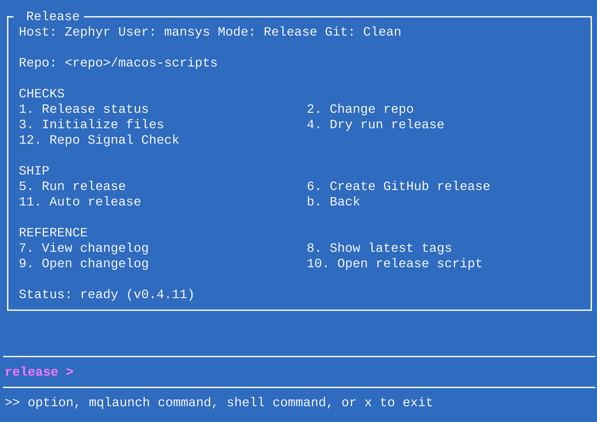
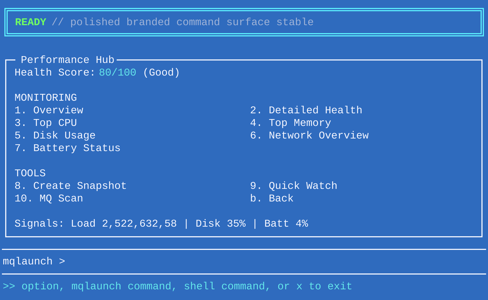
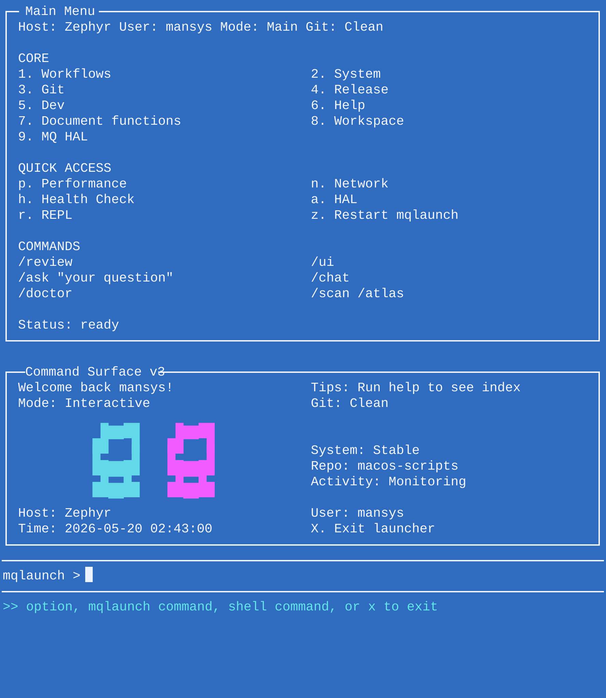

# macos-scripts ⚡


Turn scattered shell commands into structured workflows.

👉 **View case study:**
[mcamner.github.io/macos-scripts/case.html](https://mcamner.github.io/macos-scripts/case.html)

Stop memorizing commands. Start running workflows.

---

## Proof

* `install.sh` supports `--dry-run`, `--uninstall`, and `--yes` (non-interactive)
* `release.sh` validates VERSION, README badge, and CHANGELOG before every release
* `mqlaunch doctor` supports `--json` output — machine-readable health report
* `mqlaunch selftest` runs launcher smoke checks and shell syntax lint
* `mqlaunch release-check` gates every release on a `repo-signal`
  publish-readiness score
* HAL bridge supports read-only audit, release brief, repo status, and CI status
* All `.sh` files pass `bash -n` syntax check — verified by CI and
  `scripts/install-smoke.sh`
* GitHub Pages has smoke-test coverage via CI

---

## Quick start

### Requirements

This project is built for macOS with `zsh`/`bash`. The doctor command checks
the local tools used by the workflows, including `git`, `brew`, `node`,
`python`, and `jq`.

### Option 1 — Inspect, then install (recommended)

Piping a remote script straight into `bash` runs code you have not seen.
Download it, read it, then run it:

```bash
curl -fsSL \
  https://raw.githubusercontent.com/MCamner/macos-scripts/main/install.sh \
  -o install.sh
less install.sh          # review what it does
bash install.sh --dry-run   # preview changes without modifying your system
bash install.sh
```

### Option 2 — One-liner (convenience)

Only if you already trust the source. Note: fetching the script and any
checksum from the same host gives no real integrity guarantee against a
compromised source — prefer Option 1 or the clone below.

```bash
curl -fsSL \
  https://raw.githubusercontent.com/MCamner/macos-scripts/main/install.sh \
  | bash
```

### Option 3 — Clone

```bash
git clone https://github.com/MCamner/macos-scripts.git
cd macos-scripts
./install.sh
```

Uninstall later with:

```bash
./install.sh --uninstall
```

---

## ⚡ First run

```bash
mqlaunch doctor
```

This will:

* verify your environment
* check required dependencies
* validate your setup
* highlight issues with clear fixes

---

## 🚦 Then explore

```bash
mqlaunch
```

* browse workflows via the interactive menu
* or run commands directly (`perf`, `system`, `dev`, `tools`)

## Usage

Use `mqlaunch` when you want a menu, and direct commands when you already know
the workflow:

```bash
mqlaunch                         # browse menus
mqlaunch palette                 # fuzzy command search
mqlaunch system check            # system health report
mqlaunch workflows boot          # project boot workflow
mqlaunch workflows validate      # workflow command-surface health check
mqlaunch workflows save          # save workspace snapshot
mqlaunch release-check           # release readiness gate
mqlaunch repos status            # MQ ecosystem repo status
mqlaunch stack status            # canonical stack truth status via mq-agent
```

---

## ⚡ One command instead of many

Instead of:

```bash
top
df -h
ps aux | sort -nrk 3 | head
./tools/scripts/system-check.sh
```

Run:

```bash
mqlaunch perf
```

## Examples

```bash
mqlaunch hal brief               # compact repo status brief
mqlaunch hal audit               # publish quality + README score
mqlaunch review                  # delegate diff review to mq-agent/mq-mcp
mqlaunch fix "explain this shell error"
mqlaunch srm ask "what is indexed in this repo memory?"
```

---

## 🎯 What this solves

Most environments don't lack tools — they lack structure.

This project turns:

> useful chaos → usable system

---

## 🧠 Core idea

One command → structured workflows → repeatable execution

* single entrypoint: `mqlaunch`
* organized workflows (Dev, System, Performance, Git, Release, Tools)
* works as interactive menu and direct CLI
* built-in AI for questions, code generation, and error fixes

---

## 🧰 Common commands

```bash
mqlaunch                         # interactive menu
mqlaunch perf                    # performance overview
mqlaunch system check            # system health
mqlaunch dev                     # dev workflows
mqlaunch git                     # git menu
mqlaunch release                 # release menu
mqlaunch ask "your question"     # AI repo assistant
mqlaunch srm ask "your question" # Semantic Repository Memory assistant
mqlaunch fix "error or task"     # AI generates copy-paste shell commands
mqlaunch atlas                   # AI REPL session
mqlaunch review                  # review current diff via mq-agent -> mq-mcp
mqlaunch risk-review             # risk review via mq-agent -> mq-mcp
mqlaunch architecture            # show mq-mcp architecture memory
mqlaunch repo-health             # repo-signal + mq-mcp contract health
mqlaunch stack status            # canonical stack truth status via mq-agent
mqlaunch mcp-status              # mq-mcp status and tool count
mqlaunch hal                     # open HAL menu
mqlaunch hal "your request"      # local Ollama-powered safe command router
mqlaunch hal repos               # list HAL-known repos
mqlaunch hal raw "your request"  # show parsed JSON intent
mqlaunch hal doctor              # summarize mqlaunch doctor --json with local HAL
mqlaunch hal fix-doctor          # create safe fix plan from HAL Doctor Summary
mqlaunch hal session             # show local HAL session memory
mqlaunch hal last                # show latest HAL memory item
mqlaunch hal remember "note"     # save a local HAL note
mqlaunch hal timeline            # show HAL session memory as compact timeline
mqlaunch hal context             # show mqobsidian context-pack status
mqlaunch obsidian status         # read-only mqobsidian consumer status
mqlaunch obsidian inbox          # read-only memory inbox listing
mqlaunch obsidian views          # open a manifest-defined mqobsidian view
mqlaunch obsidian promote --dry-run # delegate promotion preview to mq-agent
mqlaunch hal brief               # compact repo status brief
mqlaunch hal release-brief       # release readiness brief
mqlaunch hal audit               # publish quality + README score via repo-signal
mqlaunch hal repo-status         # read-only git repo status
mqlaunch hal ci                  # GitHub Actions status
mqlaunch doctor                  # environment check
mqlaunch doctor --json           # machine-readable JSON health report
mqlaunch workflows validate      # workflow files, docs and routing check
mqlaunch selftest                # smoke tests + shell lint
mqlaunch markdownlint            # lint Markdown in the current repo
mqlaunch release-check           # release readiness check
mqlaunch repos wiki-status       # local docs + GitHub Wiki freshness
mqlaunch demo                    # guided demo
```

👉 **Full command reference:** [docs/COMMANDS.md](docs/COMMANDS.md)

Git safe merge is a Class C local mutating action: explicit confirmation
required, no push. See [docs/safety/gitmerge-safe.md](docs/safety/gitmerge-safe.md).

HAL command surface: [docs/hal-command-surface.md](docs/hal-command-surface.md)

HAL gallery: [docs/hal-gallery.md](docs/hal-gallery.md)

HAL overview page: [docs/hal.html](docs/hal.html)

HAL menu screenshot: [docs/screenshots/hal-menu.png](docs/screenshots/hal-menu.png)

## 🧠 B2 Atlas Prompt OS

Structured prompt browser and composer for architecture, review, research,
and content work — built on your local Obsidian vault.

```bash
mq b2                   # open interactive TUI
mq b2 list              # browse all 43 prompts
mq b2 route "ta fram blueprint för nytt API"
mq b2 compose 02.11 "design the payment service"
```

Navigate with `j/k`, search with `/`, compose with `c`, quit with `q`.
Full reference: [docs/B2_TUI.md](docs/B2_TUI.md)

---

## 📚 Documentation map

* [Command reference](docs/COMMANDS.md) — full `mqlaunch` command surface
* [Runtime authority](docs/RUNTIME_AUTHORITY.md) — dispatcher ownership,
  compatibility policy, and allowed responsibilities
* [Runtime authority map](docs/AUTHORITY_MAP.md) — current live, compatibility,
  deprecated, and test-only path inventory
* [B2 TUI reference](docs/B2_TUI.md) — B2 Atlas Prompt OS terminal interface
* [Terminal guide](terminal/README.md) — launchers, menus, themes, and bridges
* [Tools guide](tools/README.md) — helper scripts and utility workflows
* [Automation guide](automation/README.md) — login, shortcuts, and workflows
* [System guide](system/README.md) — macOS tweaks, monitoring, and performance
* [Skills](SKILLS.md) — local maintenance skills for this repo
* [Roadmap](ROADMAP.md) — current design boundary and next priorities

---

## 🤖 AI assistant

Ask questions about the repo directly in the terminal:

```bash
mqlaunch ask "how does command routing work?"
mqlaunch ask "what does doctor.sh check?"
```

The repo assistant uses Semantic Repository Memory by default:

```bash
MQ_REPO_VECTOR_STORE_ID=vs_your_repo_store_id
```

Query a specific Semantic Repository Memory store with the Responses API:

```bash
mqlaunch srm inspect
mqlaunch srm ask "what repo is indexed here?"
SRM_VECTOR_STORE_ID=vs_your_semantic_memory_store_id \
  mqlaunch srm search "vector store upload flow"
```

Start an interactive session with Atlas — a senior systems engineer
embedded in mqlaunch:

```bash
mqlaunch atlas
```

```text
atlas> why is my push being blocked?
atlas> explain the release flow
atlas> exit
```

Atlas answers inline without opening a browser.

---

## 🔧 Fix and generate code

Get copy-paste ready shell commands for errors and tasks:

```bash
mqlaunch fix "ERROR: CHANGELOG does not contain version 0.1.9"
mqlaunch fix "write a function that checks if a port is in use"
mqlaunch fix "add option 13 'View stash' to the git menu"
```

Output is always runnable — `cat` heredocs, `sed`, `mkdir` — no theory:

```bash
# Add changelog section for 0.1.9
cat >> CHANGELOG.md << 'EOF'
## [0.1.9] - 2026-05-07
### Changed
* ...
EOF
```

Copy, paste, run. Uses repo context from the vector store.

---

## 🚢 Release workflow

Auto Release handles the full release cycle in one flow:

```bash
mqlaunch release
# → select option 11: Auto Release
```

Steps:

1. Auto-generate changelog section from commits since last tag
2. Dry run — validates VERSION, README badge, and CHANGELOG
3. Live release — bumps version, tags, updates files
4. Git push + push tags
5. Create GitHub release

Run the release check before every push:

```bash
mqlaunch release-check
```

The release check includes a `repo-signal` publish-readiness gate. Override the
threshold with:

```bash
MQ_REPO_SIGNAL_FAIL_UNDER=14 mqlaunch release-check
```

---

## 🏷️ Nickname

Set a name that appears in every menu header:

```bash
mqlaunch nickname-set "your name"
```

Stored in `~/.mqlaunch_nickname`.

---

## 🔎 Performance scan

```bash
mq scan
```

Ranks CPU and memory offenders, highlights repeat offenders, and gives
practical recommendations for what to close or restart.

---

## 🩺 Health check

```bash
mqlaunch doctor
mqlaunch workflows validate
```

* checks required tools (git, brew, node, python, jq)
* validates repo state (branch, dirty tree, required files)
* evaluates workflow readiness (Git, Release, Dev, System)
* highlights issues and gives actionable recommendations

---

## 🧪 Selftest

```bash
mqlaunch selftest
```

Runs launcher smoke checks, v1 compatibility checks, and shell lint for
supported bash/sh scripts.

---

## 🎬 Demo

```bash
mqlaunch demo
```

---

## Screenshots

### Release Menu



### Performance Hub



### Main Menu



---

## 🧱 Project structure

```text
macos-scripts/
├── bin/               # CLI entrypoints
├── terminal/          # menus, launchers, themes
├── tools/             # scripts and utilities
├── system/            # macOS helpers
├── automation/        # workflows
├── ai-prompts/        # AI assistant prompts
├── ui/                # terminal UI
├── docs/              # screenshots and documentation
└── backups/           # workspace snapshots
```

---

## ⚖️ Design principles

* keep it simple
* structure > more tools
* optimize for real usage
* make workflows repeatable
* reduce cognitive load

---

## 🎬 Case Study

See how macos-scripts is designed as a structured CLI system:

👉 [mcamner.github.io/macos-scripts/case.html](https://mcamner.github.io/macos-scripts/case.html)

---

## 📈 Real use case

Instead of remembering 5–10 system commands during troubleshooting:

```bash
mqlaunch system check
```

→ full system overview in one step

---

## Roadmap

Current focus is documented in [ROADMAP.md](ROADMAP.md). The main boundary is:

```text
mqlaunch shows menu → delegates → mq-agent orchestrates → mq-mcp executes
```

Near-term priorities:

* release gate integration
* plugin-style extensions
* remote execution support
* improved onboarding

---

## Contributing

PRs and issues are welcome.

Good first contributions:

* add or improve a workflow under `automation/`, `tools/`, or `system/`
* improve command docs in [docs/COMMANDS.md](docs/COMMANDS.md)
* add smoke coverage under `tests/`
* polish terminal menu labels, spacing, or discoverability

Before opening a PR, run:

```bash
mqlaunch selftest
mqlaunch release-check
```

---

## 🔒 Security

Core scripts run locally on your machine.

AI-assisted commands (`ask`, `fix`, `atlas`, `srm`) may send prompts, selected
repository context, or error text to the configured AI provider. Do not use
AI commands with secrets, private credentials, or sensitive files unless you
understand what is being sent.

Never commit API keys, tokens, or credentials. Use environment variables or
ignored local files for sensitive values.

---

## 📄 License

MIT
